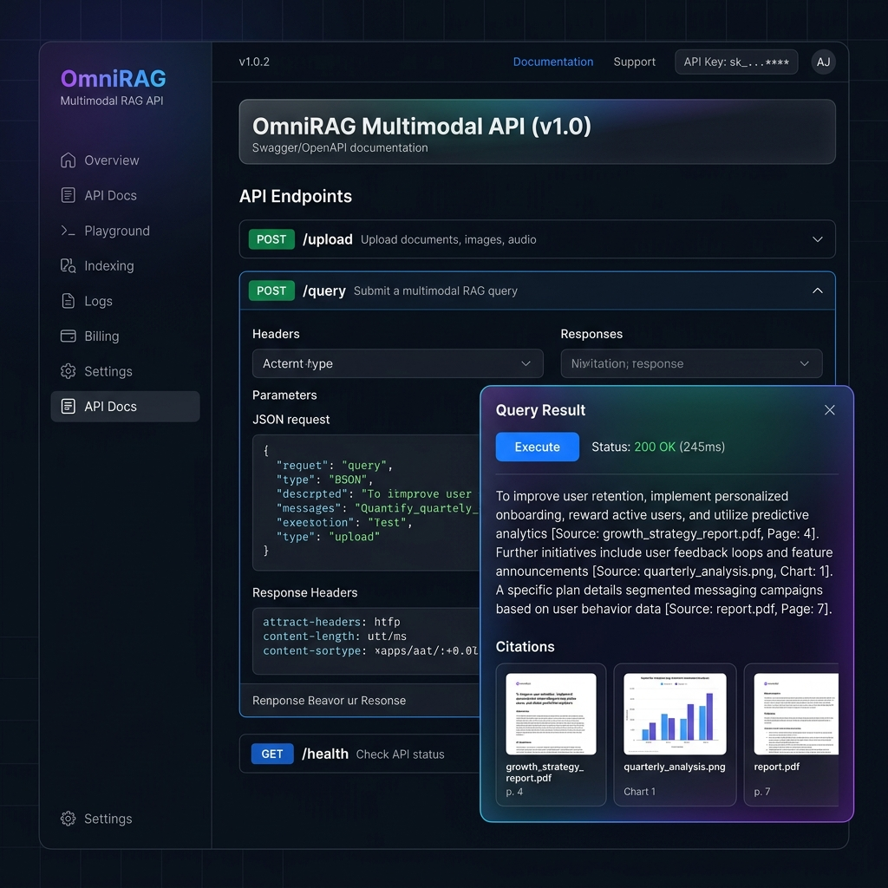
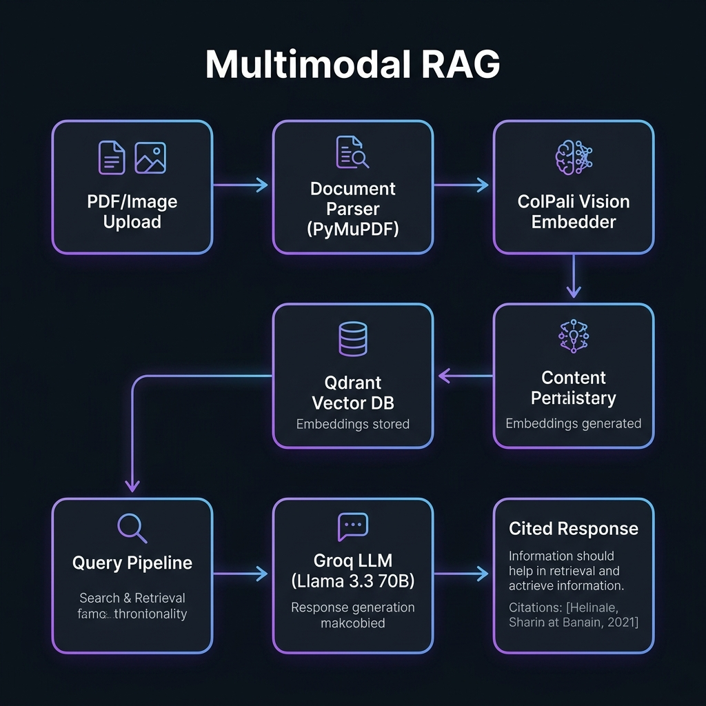

<p align="center">
  
</p>

<h1 align="center">🔮 OmniRAG — Multimodal RAG Pipeline</h1>

<p align="center">
  <strong>Enterprise-grade Retrieval-Augmented Generation for PDFs, Images & Tables</strong>
</p>

<p align="center">
  <a href="https://ai-workflow-ochre.vercel.app/docs"></a>
  
  
  
  
  
</p>

---

## 📋 Overview

**OmniRAG** is a production-ready multimodal Retrieval-Augmented Generation pipeline designed for enterprises that need to extract intelligence from heterogeneous document formats — PDFs, scanned images, embedded tables — all through a single, unified API.

Unlike traditional text-only RAG systems, OmniRAG leverages **vision-language models** (ColPali) to understand documents as humans see them — preserving layout, table structure, and visual context that text extraction alone destroys.

### ✨ Key Features

| Feature | Description |
|---------|-------------|
| 🔍 **Multimodal Ingestion** | Process PDFs, images (PNG/JPG/WebP), and embedded tables through a unified pipeline |
| 🧠 **Vision-Language Embeddings** | ColPali v1.2 encodes document pages as visual patches — no OCR errors, no lost formatting |
| ⚡ **Vector Retrieval** | Qdrant-powered similarity search with cosine distance for sub-second retrieval |
| 🤖 **LLM Generation** | Groq-accelerated Llama 3.3 70B for ultra-fast, high-quality responses |
| 📝 **Source Citations** | Every answer includes inline citations with exact source file and page number |
| 🔄 **API Key Rotation** | Built-in key rotation with automatic failover across multiple Groq API keys |
| 🌐 **Production API** | FastAPI with OpenAPI docs, health checks, and structured error handling |

---

## 🏗️ Architecture

<p align="center">
  
</p>

```
┌─────────────┐     ┌──────────────┐     ┌─────────────────┐     ┌────────────┐
│  PDF/Image  │────▶│  Document    │────▶│  ColPali Vision │────▶│   Qdrant   │
│   Upload    │     │  Parser      │     │  Embedder       │     │  Vector DB │
└─────────────┘     │  (PyMuPDF)   │     │  (v1.2)         │     └─────┬──────┘
                    └──────────────┘     └─────────────────┘           │
                                                                       │
┌─────────────┐     ┌──────────────┐     ┌─────────────────┐          │
│  Cited      │◀────│  Groq LLM    │◀────│  RAG Service    │◀─────────┘
│  Response   │     │  (Llama 3.3) │     │  (Retrieval +   │
└─────────────┘     └──────────────┘     │   Generation)   │
                                          └─────────────────┘
```

---

## 🛠️ Tech Stack

<table>
  <tr>
    <td><strong>Layer</strong></td>
    <td><strong>Technology</strong></td>
    <td><strong>Purpose</strong></td>
  </tr>
  <tr>
    <td>🌐 API</td>
    <td>FastAPI + Uvicorn</td>
    <td>Async REST API with auto-generated OpenAPI docs</td>
  </tr>
  <tr>
    <td>📄 Parsing</td>
    <td>PyMuPDF (fitz) + Pillow</td>
    <td>PDF page rendering, image processing, text extraction</td>
  </tr>
  <tr>
    <td>🧠 Embeddings</td>
    <td>ColPali v1.2</td>
    <td>Vision-language document embeddings (multi-vector)</td>
  </tr>
  <tr>
    <td>💾 Vector Store</td>
    <td>Qdrant</td>
    <td>High-performance vector similarity search</td>
  </tr>
  <tr>
    <td>🤖 LLM</td>
    <td>Groq (Llama 3.3 70B)</td>
    <td>Ultra-fast inference for response generation</td>
  </tr>
  <tr>
    <td>🚀 Deployment</td>
    <td>Vercel (Serverless)</td>
    <td>Zero-config Python serverless functions</td>
  </tr>
</table>

---

## 📂 Project Structure

```
omnirag-multimodal-rag/
├── api/
│   └── index.py                 # Vercel serverless entrypoint
├── src/
│   ├── api/
│   │   ├── main.py              # FastAPI application & route handlers
│   │   └── rag_service.py       # RAG orchestration (embed → retrieve → generate)
│   ├── ingestion/
│   │   └── document_parser.py   # PDF/Image parsing → DocumentPage objects
│   ├── embeddings/
│   │   └── colpali_embedder.py  # ColPali v1.2 vision-language embedder
│   ├── database/
│   │   └── qdrant_client.py     # Qdrant vector store operations
│   └── llm/
│       └── key_rotator.py       # Multi-key rotation with automatic failover
├── assets/                      # README images & demo assets
├── requirements.txt             # Python dependencies
├── vercel.json                  # Vercel deployment configuration
├── .env.example                 # Environment variable template
└── README.md
```

---

## 🚀 Quick Start

### Prerequisites

- **Python 3.10+**
- **Groq API Key** — Get one free at [console.groq.com](https://console.groq.com)

### 1️⃣ Clone & Install

```bash
git clone https://github.com/harshagm665-netizen/omnirag-multimodal-rag.git
cd omnirag-multimodal-rag
python -m venv venv
source venv/bin/activate  # Windows: venv\Scripts\activate
pip install -r requirements.txt
```

### 2️⃣ Configure Environment

```bash
cp .env.example .env
# Edit .env and add your Groq API key
```

### 3️⃣ Run Locally

```bash
uvicorn src.api.main:app --reload --host 0.0.0.0 --port 8000
```

The API is now live at **http://localhost:8000** — visit **http://localhost:8000/docs** for the interactive Swagger UI.

---

## 📡 API Reference

### `POST /upload` — Ingest a Document

Upload a PDF or image file for processing, embedding, and storage.

```bash
curl -X POST http://localhost:8000/upload \
  -F "file=@financial_report.pdf"
```

**Response:**
```json
{
  "message": "Successfully ingested financial_report.pdf (12 pages)."
}
```

### `POST /query` — Query the RAG System

Ask a natural language question over your ingested documents.

```bash
curl -X POST http://localhost:8000/query \
  -H "Content-Type: application/json" \
  -d '{"query": "What was the Q3 revenue growth?"}'
```

**Response:**
```json
{
  "answer": "The Q3 revenue grew by 23% year-over-year, reaching $4.2B [Source: financial_report.pdf, Page: 7].",
  "citations": [
    {"source": "financial_report.pdf", "page": 7, "score": 0.94}
  ]
}
```

### `GET /health` — Health Check

```bash
curl http://localhost:8000/health
```

```json
{"status": "healthy", "components": ["ColPali", "Qdrant", "Groq"]}
```

---

## ☁️ Deployment

### Vercel (Recommended)

The project is pre-configured for Vercel serverless deployment:

```bash
npm i -g vercel
vercel --prod
```

> **Live instance:** [ai-workflow-ochre.vercel.app](https://ai-workflow-ochre.vercel.app/docs)

### Docker (Coming Soon)

```dockerfile
# Dockerfile support planned for GPU-enabled ColPali inference
```

---

## 🔑 Environment Variables

| Variable | Required | Description |
|----------|----------|-------------|
| `llm_api_key` | ✅ | Primary Groq API key |
| `GROQ_BACKUP_KEYS` | ❌ | Comma-separated backup Groq keys for rotation |
| `llm_proxy` | ❌ | Optional HTTP proxy for API calls |

---

## 🧪 How It Works

1. **Document Ingestion** — PDFs are rendered page-by-page into high-res images (150 DPI). Images are loaded directly. Each page becomes a `DocumentPage` with extracted text metadata.

2. **Vision Embeddings** — ColPali v1.2 processes each page image through a vision transformer, generating dense vector representations that capture both textual and visual layout information.

3. **Vector Storage** — Embeddings are stored in Qdrant with full metadata (source file, page number, extracted text) for citation tracking.

4. **Query Pipeline** — User queries are embedded with ColPali, matched against stored vectors via cosine similarity, and the top-k contexts are passed to the LLM.

5. **Cited Generation** — Groq's Llama 3.3 70B generates responses with mandatory inline citations, ensuring every fact is traceable to its source document and page.

---

## 🗺️ Roadmap

- [ ] 🐳 Docker + GPU support for production ColPali inference
- [ ] 📊 Table-aware extraction with specialized parsers
- [ ] 🔄 Streaming responses via SSE
- [ ] 🧩 LangChain / LlamaIndex integration
- [ ] 📈 Usage analytics dashboard
- [ ] 🔐 Authentication & API key management
- [ ] 🌍 Multi-language document support

---

## 🤝 Contributing

Contributions are welcome! Please feel free to submit a Pull Request.

1. Fork the repository
2. Create your feature branch (`git checkout -b feature/amazing-feature`)
3. Commit your changes (`git commit -m 'Add amazing feature'`)
4. Push to the branch (`git push origin feature/amazing-feature`)
5. Open a Pull Request

---

## 📄 License

This project is licensed under the **MIT License** — see the [LICENSE](LICENSE) file for details.

---

<p align="center">
  Built with ❤️ by <a href="https://github.com/harshagm665-netizen">@harshagm665-netizen</a>
</p>
